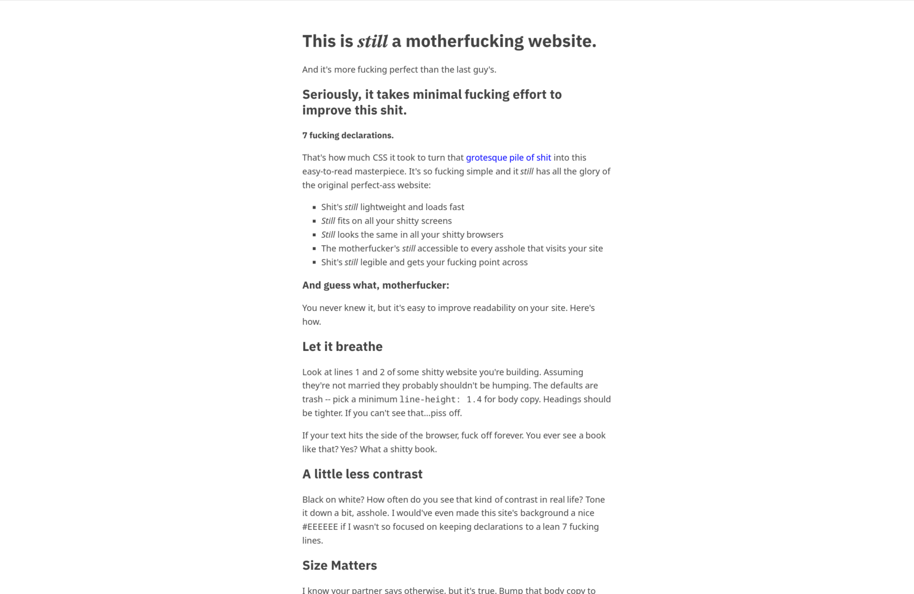

# litehtml-rs

[](https://crates.io/crates/litehtml)

Rust bindings for [litehtml](https://github.com/litehtml/litehtml) -- a lightweight HTML/CSS rendering engine. It handles email HTML and simple, content-focused websites well (think [bettermotherfuckingwebsite.com](http://bettermotherfuckingwebsite.com/)), but modern JS-heavy sites with megabytes of CSS will be slow or render incorrectly.

## Crates

| Crate | Description |
|-------|-------------|
| `litehtml-sys` | Raw FFI bindings via a C wrapper (litehtml is C++) |
| `litehtml` | Safe Rust API with `DocumentContainer` trait |

## Features

The `litehtml` crate has these feature flags:

- **`vendored`** (default) -- compile litehtml from bundled source. Disable to link against a system-installed litehtml (set `LITEHTML_DIR` or ensure headers/lib are on the search path).
- **`pixbuf`** -- CPU-based pixel buffer backend using `tiny-skia` and `cosmic-text`. Gives you `PixbufContainer` and `render_to_rgba()`.
- **`html`** -- General-purpose HTML utilities: encoding detection, sanitization, `data:`/`cid:` URI resolution, legacy attribute preprocessing, and a `prepare_html` pipeline.
- **`email`** -- Email-specific defaults on top of `html`: `EMAIL_MASTER_CSS` and a `prepare_email_html` convenience wrapper.



## Usage

```rust
use litehtml::pixbuf::{PixbufContainer, render_to_rgba};

// Quick render to RGBA pixel buffer
let pixels = render_to_rgba("<p>Hello world</p>", 600, 400);

// Or use the full API for more control
let mut container = PixbufContainer::new(600, 400);
let master_css = litehtml::email::EMAIL_MASTER_CSS;

if let Ok(mut doc) = Document::from_html(html, &mut container, Some(master_css), None) {
    doc.render(600.0);
    doc.draw(0, 0.0, 0.0, None);
}

let pixels = container.pixels(); // premultiplied RGBA
```

## Building

Requires a C++17 compiler and `clang` (for bindgen).

With direnv (GUIX -- see `.envrc`):

```bash
direnv allow
cargo test --workspace --features 'litehtml/pixbuf,litehtml/html'
```

Without direnv:

```bash
# Ubuntu/Debian
sudo apt-get install libclang-dev
cargo test --workspace --all-features

# GUIX (manual)
guix shell -m manifest.scm -- sh -c \
  "CC=gcc LIBCLANG_PATH=$(dirname $(find $(guix build clang-toolchain) -name 'libclang.so' | head -1)) \
  cargo test --workspace --all-features"
```

## Examples

### render -- local HTML files

Sample HTML files are in `examples/`. To view them in a window:

```bash
cargo run --example render --features pixbuf -p litehtml -- examples/article.html
cargo run --example render --features pixbuf -p litehtml -- examples/email.html 600
```

Scroll with mouse wheel, arrow keys, Page Up/Down, Home/End. Click and drag to select text. Escape to close. Optional second argument sets the viewport width (default 800).

### browse -- live web pages

Fetches a URL, loads external CSS and images, and renders the page:

```bash
cargo run --example browse --features pixbuf -p litehtml -- https://example.com
cargo run --example browse --features pixbuf -p litehtml -- https://example.com 1024
cargo run --example browse --features pixbuf -p litehtml -- https://example.com 1920 --height 1080 --fullscreen
```

Uses `ureq` for HTTP and `url` for URL resolution. The example wraps `PixbufContainer` with a `BrowseContainer` that overrides `import_css` to fetch external stylesheets, `set_base_url` to track `<base>` tag changes, and `load_image` to capture the baseurl context for correct resolution. CSS and image URLs are resolved against their source context (e.g. a stylesheet's URL), not just the page URL. A browser User-Agent is sent to avoid being served degraded content. Images are fetched between render passes until layout stabilizes.


## HTML preprocessing

The `html` feature provides a full preprocessing pipeline for rendering HTML:

```rust
use litehtml::html::{prepare_html, sanitize_html, decode_html};

let prepared = prepare_html(raw_bytes, Some(&cid_resolver), None);
// prepared.html -- sanitized UTF-8 HTML
// prepared.images -- resolved data:/cid: images
```

This handles encoding detection (UTF-8, Windows-1252, ISO-8859-1), strips dangerous elements (`<script>`, `<iframe>`, event handlers), resolves inline images, and preprocesses legacy attributes (`bgcolor` on `<body>`, `cellpadding`).

Remote image fetching is off by default. Pass a `url_fetcher` closure as the third argument to opt in with your own HTTP client.

## Email rendering

The `email` feature adds email-specific defaults on top of `html`:

```rust
use litehtml::email::{prepare_email_html, EMAIL_MASTER_CSS};

let prepared = prepare_email_html(raw_bytes, Some(&cid_resolver), None);
```

`EMAIL_MASTER_CSS` provides an email user-agent stylesheet (body reset, responsive images, table normalization, MSO workarounds).

## Integration guide

When building on `PixbufContainer`, there are a few things litehtml expects you to handle yourself. The `browse` example demonstrates all of these patterns -- see `litehtml/examples/browse.rs`.

### Render lifecycle

litehtml separates parsing, layout, and drawing. A typical flow:

```
from_html()  →  render()  →  [fetch images]  →  render()  →  draw()
   parse          layout       your HTTP          re-layout     rasterize
   + CSS import                                   (sizes changed)
```

1. **`from_html()`** parses HTML and calls `import_css` for each `<link rel="stylesheet">`. CSS fetching is synchronous -- return the CSS content directly.
2. **`render(width)`** runs layout. During layout, `load_image` is called for each ``. Images aren't loaded yet, so elements get zero-sized placeholders.
3. **Fetch images** yourself, then call `load_image_data()` to hand the decoded bytes back.
4. **`render()` again** -- now that image dimensions are known, layout shifts to accommodate them. New images may be discovered after re-layout (e.g. in previously collapsed containers), so loop until `take_pending_images()` returns empty.
5. **`draw()`** rasterizes into the pixel buffer.

### CSS loading

Override `import_css` on your container to fetch external stylesheets. The method takes `&self`, so use `RefCell` for any mutable state (cache, HTTP client).

The `baseurl` parameter is the URL context for resolution -- for top-level `<link>` stylesheets it's the page URL, but for nested `@import` within CSS files it's the importing stylesheet's URL. Always resolve against `baseurl`, not just the page URL. Cache by resolved URL to avoid re-fetching across `from_html()` calls.

Return `(css_text, Some(resolved_url))` so litehtml uses the resolved URL as the base for relative references (`url(...)`, nested `@import`) inside the stylesheet.

```rust
fn import_css(&self, url: &str, baseurl: &str) -> (String, Option<String>) {
    let resolved = resolve_against(url, baseurl);
    if let Some(cached) = self.css_cache.borrow().get(resolved.as_str()) {
        return (cached.clone(), Some(resolved.to_string()));
    }
    let css = fetch(&resolved);  // your HTTP client
    self.css_cache.borrow_mut().insert(resolved.to_string(), css.clone());
    (css, Some(resolved.to_string()))
}
```

### Image loading

litehtml discovers images during layout and notifies you via `load_image()`. The default `PixbufContainer` queues these URLs internally.

The `baseurl` parameter matters here too -- images referenced in external stylesheets (e.g. `background: url(...)`) should resolve against that stylesheet's URL, not the page URL. Capture the baseurl in `load_image` and use it when fetching.

```rust
fn load_image(&mut self, src: &str, baseurl: &str, redraw_on_ready: bool) {
    self.image_baseurls.insert(src.to_string(), baseurl.to_string());
    self.inner.load_image(src, baseurl, redraw_on_ready);
}

// After each render() pass, drain and fetch pending images
let pending = container.take_pending_images();
for (src, _redraw_on_ready) in &pending {
    let baseurl = image_baseurls.get(&src).unwrap_or_default();
    let url = resolve_against(src, baseurl);
    if let Some(data) = fetch_bytes(&url) {
        container.load_image_data(src, &data);
    }
}
// Re-render to incorporate image sizes into layout
```

The `redraw_on_ready` flag indicates whether the image only needs a redraw (decorative, size already known from HTML attributes) or a full re-render (size affects layout). In a GUI, you can use this to decide between a cheap repaint vs. a full layout pass.

### URL resolution

Relative URLs appear in several callbacks (`import_css`, `load_image`, `on_anchor_click`). Each callback receives a `baseurl` parameter that reflects the URL context -- the page URL, a stylesheet URL, etc. Always resolve against the provided `baseurl`, falling back to the page's base URL only when `baseurl` is empty.

Track the page's base URL via `set_base_url` (called when a `<base>` tag is encountered). Protocol-relative URLs (`//cdn.example.com/...`) and `data:` URIs are handled automatically by standard URL parsers.

### Anchor clicks

After calling `doc.on_lbutton_up()`, check `container.take_anchor_click()`. If it returns a URL, resolve it against the base URL and navigate. For same-page anchors (fragment-only URLs like `#section`), use `doc.root().select_one()` to find the target element and scroll to its position.

### Pixel data

`container.pixels()` returns premultiplied RGBA. To composite against a white background for display:

```rust
// out = src_premul + white * (1 - src_alpha)
let r = src_r + (255 * (255 - a) + 127) / 255;
```

If your framework expects straight alpha (e.g. iced's `image::Handle::from_rgba`), unpremultiply instead.

### HiDPI

Use `new_with_scale(width, height, scale)` and `resize_with_scale()`. Logical dimensions go to litehtml; the internal pixmap is allocated at physical resolution. Mouse coordinates from the windowing system are typically in physical pixels -- divide by the scale factor before passing to litehtml.
